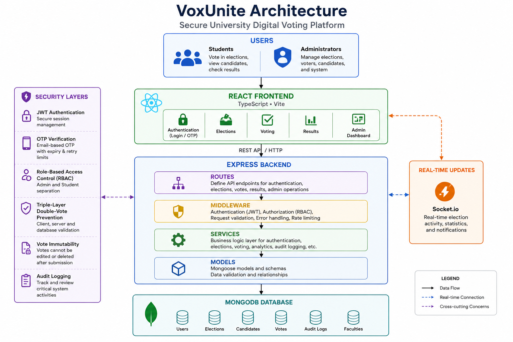
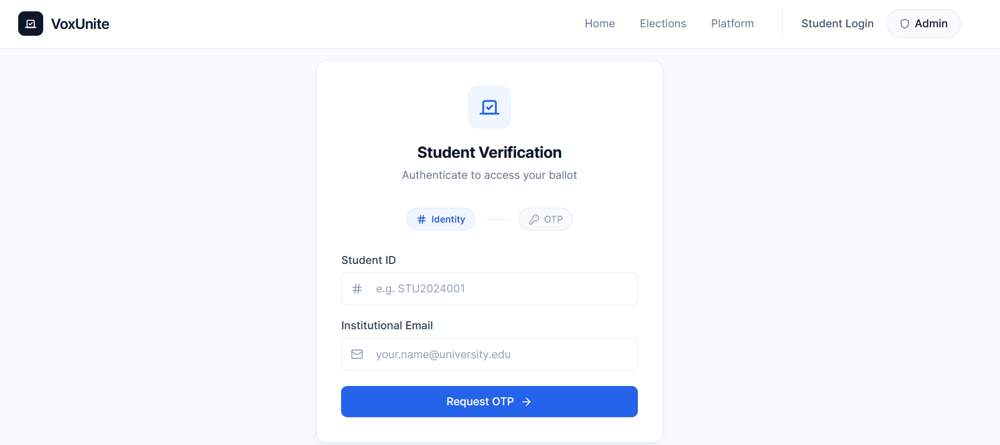
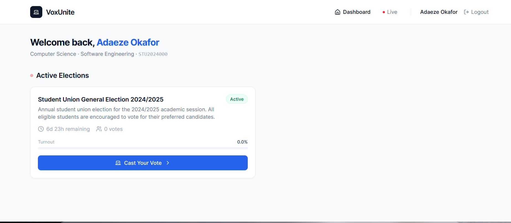
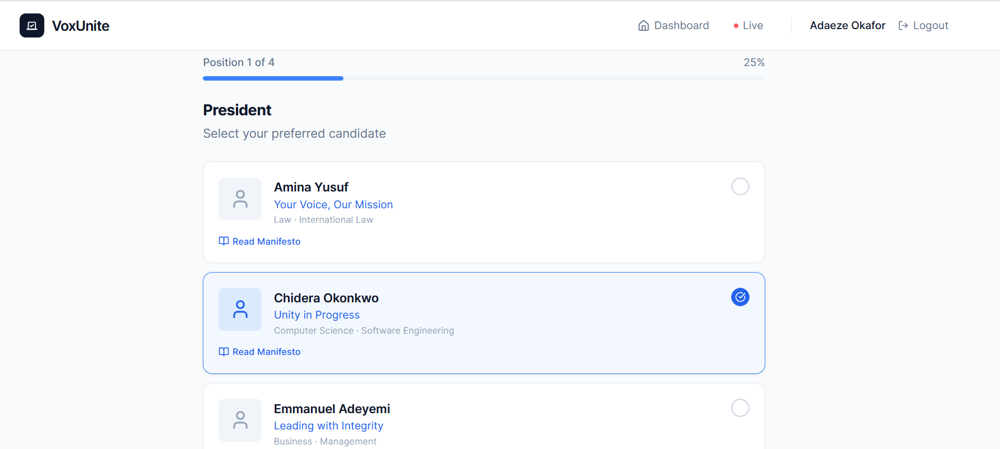
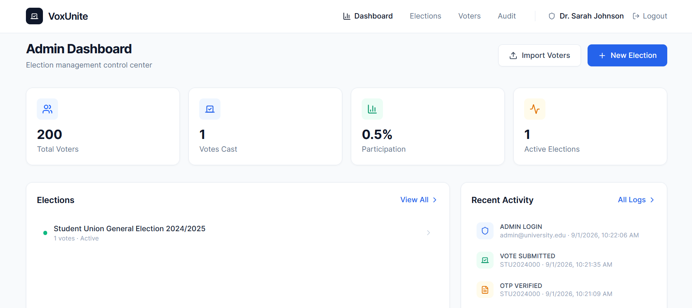
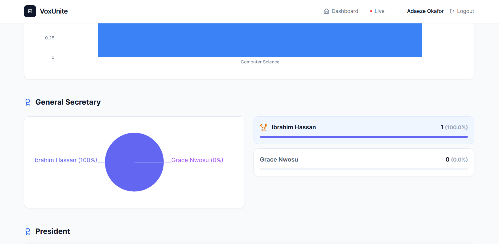

# VoxUnite - University Digital Voting Platform

VoxUnite is a MERN stack university election platform with student OTP verification, administrator election management, vote records, audit logs, and real-time election monitoring.
# VoxUnite - Secure University Digital Voting Platform
VoxUnite is a web-based university digital voting platform developed
to explore secure election management, voter authentication, vote
integrity, access control, auditability, and privacy considerations
in an online voting environment.

The project combines a React/TypeScript frontend with a
Node.js/Express backend and MongoDB database.

> **Academic project:** VoxUnite is intended for educational,
> demonstration, and research purposes. It should not be deployed
> for real-world elections without additional security testing,
> independent auditing, and privacy-preserving mechanisms.

---

## Project Overview
University elections can involve large numbers of eligible voters,
multiple candidates, several positions, and administrative processes
that can be difficult to manage manually.

VoxUnite provides a centralized platform for:
- Student authentication and OTP verification
- Election creation and lifecycle management
- Candidate management
- Voter eligibility management
- Secure vote submission
- Layered double-vote prevention
- Election monitoring
- Audit logging
- Election analytics
- Real-time election updates

The project was developed as a practical exploration of secure
software and digital voting workflows.

---

## Key Features
### Student

- Student ID and email authentication
- OTP-based verification
- JWT-based authenticated sessions
- Election and candidate viewing
- Candidate manifesto viewing
- Vote submission
- Vote confirmation
- Mobile-responsive interface
- Prevention of repeated voting

### Administrator

- Administrator authentication
- Role-based access control
- Voter CSV/XLSX import
- Candidate management
- Candidate photo uploads
- Election creation
- Election activation and closure
- Election lifecycle management
- Election analytics
- Searchable audit logs
- Election results management

### Real-Time Monitoring

- Election countdown
- Faculty turnout statistics
- Participation monitoring
- Live activity feed
- Faculty participation leaderboard
- Socket.io real-time updates

---

## System Architecture

VoxUnite follows a client-server architecture.



### Architecture Layers

Users
  │
  ▼
React / TypeScript Frontend
  │
  │ REST API
  ▼
Node.js / Express Backend
  │
  ├── Routes
  ├── Middleware
  ├── Services
  └── Models
  │
  ▼
MongoDB

Socket.io
  │
  └── Real-Time Updates

The backend separates routing, middleware, business services, and
database models to provide a clearer separation of concerns.

## Security & Privacy
VoxUnite implements multiple application and database-level controls
to protect authentication, authorization, and vote integrity.

## Authentication
Student authentication follows this general flow:

Student ID + Email
        │
        ▼
    OTP Request
        │
        ▼
   OTP Verification
        │
        ▼
   JWT Session
        │
        ▼
 Protected Student APIs

The system uses:
- OTP verification
- JWT authentication
- Token expiration
- Student/admin token separation
- Protected API routes

## Role-Based Access Control

Administrative and student functionality is separated through
authentication middleware.
Administrative operations require authenticated administrator
access, while voting operations require an authenticated student
session.

## Layered Double-Vote Prevention
VoxUnite uses multiple checks to reduce repeated voting:
## 1. Voter-state check
The eligible voter record tracks elections in which the voter has
already participated.
## 2. Application-level vote lookup
The voting route checks whether a vote already exists for the
voter and election.
## 3. Database-level uniqueness constraints
The Vote model uses unique compound indexes involving the election
and voter identifiers.

This provides defense in depth against duplicate ballot submission.

## Vote Records

After a vote is submitted, the normal application workflow does not
provide a mechanism for the voter to edit or delete the submitted
ballot.
The system therefore treats submitted vote records as final within
the application workflow.

## OTP Security
OTP sessions include:
- Expiration
- Retry tracking
- Verification state
- Single-use state
- Automatic expiration through a MongoDB TTL index

The current academic implementation stores the OTP value in the OTP
session document.
A production implementation should consider hashing OTP values before
storage and using a secure external OTP delivery mechanism.

## Audit Logging
VoxUnite maintains application-level audit logs for important
authentication and election-management events, including:
- Authentication events
- OTP events
- Election lifecycle changes
- Voter imports
- Candidate management
- Vote submission

Audit records can include:
- Actor
- Role
- Action
- Metadata
- Timestamp
- IP address
- User-agent information

The current implementation provides application-level auditability.
It does not claim cryptographically tamper-evident audit logs.

## Privacy Considerations
VoxUnite separates authentication and voting workflows at the
application level and incorporates controls for voter eligibility,
vote integrity, and duplicate-vote prevention.

However, the current academic implementation retains voter identifiers
and contextual metadata with vote records to support eligibility
verification, duplicate-vote prevention, auditing, and analytics.
Therefore, the current implementation should not be considered a
strongly anonymous or unlinkable voting system.
This is an important limitation and potential area for future
research.
A privacy-preserving production voting system could investigate
mechanisms such as:

- Anonymous credentials
- Cryptographic voting protocols
- Privacy-preserving eligibility verification
- Cryptographic ballot commitments
- Verifiable election protocols

These approaches could help separate proof of voter eligibility from
ballot identity.

## Technology Stack
## Frontend
React 18
TypeScript
Vite
Tailwind CSS
Framer Motion

## Backend
Node.js
Express.js
TypeScript

## Database
MongoDB
Mongoose

##Authentication & Security
JSON Web Tokens (JWT)
OTP verification
Role-based access control
Zod request validation
MongoDB uniqueness constraints

##Real-Time Communication
Socket.io
## Data Visualization
Recharts

## Project Structure
VoxUnite/
├── client/
│   └── src/
│       ├── assets/
│       ├── components/
│       ├── contexts/
│       ├── lib/
│       ├── pages/
│       ├── App.tsx
│       ├── index.css
│       └── main.tsx
│
├── server/
│   └── src/
│       ├── middleware/
│       │   ├── auth.ts
│       │   ├── errorHandler.ts
│       │   ├── upload.ts
│       │   └── validate.ts
│       │
│       ├── models/
│       │   ├── Admin.ts
│       │   ├── AuditLog.ts
│       │   ├── Candidate.ts
│       │   ├── Election.ts
│       │   ├── EligibleVoter.ts
│       │   ├── OtpSession.ts
│       │   └── Vote.ts
│       │
│       ├── routes/
│       ├── services/
│       │   ├── auditService.ts
│       │   ├── otpService.ts
│       │   └── voterParser.ts
│       └── ...
│
├── docs/
│   └── architecture.png
│
└── README.md

## Demo Environment

The repository includes seeded accounts and sample election data for
local development and demonstration purposes.

Important: These credentials are intended exclusively for the
local/demo environment. Do not reuse them in a production
environment.

## Demo Administrator
Email: admin@university.edu
Password: Admin@VoxUnite2024

## Architecture

| Layer | Technology |
| --- | --- |
| Frontend | React, TypeScript, Vite, Tailwind CSS, Framer Motion |
| Backend | Node.js, Express.js, TypeScript |
| Database | MongoDB, Mongoose |
| Real-time | Socket.io |
| Auth | JWT sessions in HttpOnly cookies, student OTP verification |
| Charts | Recharts |

## Quick Start

### Prerequisites

- Node.js 18+
- MongoDB running locally, or a MongoDB Atlas URI
The seed process also creates sample voters, candidates, faculties,
and election data.

## Demo OTP
In the current demonstration environment, OTP delivery is simulated
for local testing.

A production deployment would require a secure OTP delivery service.

## Getting Started
Prerequisites
Node.js 18+
MongoDB running locally or MongoDB Atlas
npm

## 1. Clone the repository
git clone https://github.com/Haggla123/VoxUnite.git
cd VoxUnite

```bash
cd server
npm install

cd ../client
##2. Install backend dependencies
cd server
npm install

## 3. Install frontend dependencies
Open another terminal:
cd client
npm install --legacy-peer-deps

## 4. Configure environment variables
Create a local environment file:
server/.env

Create `server/.env`:

```env
PORT=5000
MONGODB_URI=mongodb://localhost:27017/voxunite
JWT_SECRET=replace_with_a_long_random_secret
JWT_EXPIRES_IN=24h
OTP_EXPIRY_MINUTES=5
OTP_MAX_RETRIES=3
OTP_SALT_ROUNDS=10
CORS_ORIGIN=http://localhost:5173
COOKIE_SAME_SITE=lax
```

Use `COOKIE_SAME_SITE=none` only when the API and client are on different sites over HTTPS. In that mode, cookies are sent with the `Secure` flag.

### 3. Seed Demo Data

```bash
cd ..
npm run seed --prefix server
```

This creates:

- Admin: `admin@university.edu` / `Admin@VoxUnite2024`
- 200 eligible students across 6 faculties
- An active election with candidates across multiple positions

### 4. Start Development

Open two terminals.

Terminal 1:
```bash
cd server
Example:
PORT=5000
MONGODB_URI=mongodb://localhost:27017/voxunite
JWT_SECRET=your_local_secret
CORS_ORIGIN=http://localhost:5173

## 5. Seed demonstration data
cd server
npm run seed

## 6. Start the backend
npm run dev
```

## 7. Start the frontend
In another terminal:
cd client
npm run dev

Open `http://localhost:5173`.

## Authentication Flow

### Student Login

1. A student submits Student ID and institutional email.
2. The server verifies that the student is in the eligible voter registry.
3. The server generates a short-lived OTP and stores only a bcrypt hash of it.
4. After OTP verification, the server sets a student JWT session in an HttpOnly cookie.
5. Student-only APIs, including vote submission, read the cookie server-side.

The demo UI still displays the OTP so local testers can complete the flow without email delivery. Production deployments should send the OTP through an institutional email provider and stop returning `demoOtp`.

### Admin Login

1. An admin submits email and password.
2. The server verifies the bcrypt-hashed admin password.
3. The server sets an admin JWT session in an HttpOnly cookie.
4. Admin-only APIs verify the cookie and enforce role-based access.

## Security Model

- JWTs are stored in `HttpOnly`, `SameSite` cookies and are not written to `localStorage`.
- Admin and student sessions use separate cookies, and successful login clears the other session type.
- Logout endpoints clear both session cookies.
- Student OTPs are bcrypt-hashed before database storage, expire automatically, and enforce retry limits.
- Socket.io handshakes require a valid admin or student session cookie before real-time events are delivered.
- Vote submission requires a valid student session and checks election status, voter eligibility, duplicate vote records, and the voter's election history.
- Admin APIs use authenticated middleware and role checks where needed.
- Audit logs record authentication events, vote submission, and administrative actions.

See [SECURITY.md](SECURITY.md) for vulnerability reporting and deployment guidance.

## Features

### Student

- OTP-based student verification
- Mobile-responsive voting booth
- Candidate and manifesto review
- Vote receipt confirmation
- Live election monitor for authenticated users

### Admin

- CSV/XLSX voter import with header normalization
- Election lifecycle management: draft, scheduled, active, closed
- Candidate management with photo upload
- Analytics dashboard
- Searchable audit logs
- Safe/live results visibility controls

## Project Structure

```text
VoxUnite/
|-- server/
|   |-- src/
|   |   |-- models/
|   |   |-- routes/
|   |   |-- middleware/
|   |   |-- services/
|   |   |-- index.ts
|   |   `-- seed.ts
|   `-- uploads/
|-- client/
|   |-- src/
|   |   |-- pages/
|   |   |-- components/
|   |   |-- contexts/
|   |   `-- lib/
|   `-- index.html
|-- README.md
`-- SECURITY.md
```

## API Endpoints

| Method | Endpoint | Auth | Description |
| --- | --- | --- | --- |
| POST | `/api/admin/login` | Public | Admin login; sets admin session cookie |
| POST | `/api/admin/logout` | Cookie | Clears session cookies |
| GET | `/api/admin/me` | Admin | Current admin profile |
| POST | `/api/auth/request-otp` | Public | Request student OTP |
| POST | `/api/auth/verify-otp` | Public | Verify OTP; sets student session cookie |
| POST | `/api/auth/logout` | Cookie | Clears session cookies |
| GET | `/api/auth/me` | Student | Current student profile |
| GET | `/api/elections` | Public | List elections |
| POST | `/api/elections` | Admin | Create election |
| POST | `/api/elections/:id/activate` | Admin | Activate election |
| POST | `/api/elections/:id/close` | Admin | Close election |
| POST | `/api/voters/upload` | Admin | Import voter CSV/XLSX |
| POST | `/api/candidates` | Admin | Add candidate |
| POST | `/api/votes` | Student | Cast vote |
| GET | `/api/votes/check/:electionId` | Student | Check vote status |
| GET | `/api/results/:id` | Public | Get results according to visibility rules |
| GET | `/api/analytics/dashboard` | Admin | Dashboard stats |
| GET | `/api/analytics/audit-logs` | Admin | Audit logs |

## Deployment

### Backend

```bash
cd server
npm run build
npm start
```

### Frontend

```bash
cd client
npm run build
```

Set production environment variables:

- `MONGODB_URI`
- `JWT_SECRET`
- `JWT_EXPIRES_IN`
- `OTP_EXPIRY_MINUTES`
- `OTP_MAX_RETRIES`
- `OTP_SALT_ROUNDS`
- `CORS_ORIGIN`
- `COOKIE_SAME_SITE`

For production, use HTTPS, a long random `JWT_SECRET`, restricted CORS origins, secure cookie settings, database backups, and a real OTP delivery provider.

## License

MIT License - Built for academic institutions.
The development frontend should be available at:
http://localhost:5173

🔌 API Overview
Method	Endpoint	Access	Description
POST	/api/admin/login	Public	Administrator login
POST	/api/auth/request-otp	Public	Request student OTP
POST	/api/auth/verify-otp	Public	Verify OTP
GET	/api/elections	Public	List elections
POST	/api/elections	Admin	Create election
POST	/api/elections/:id/activate	Admin	Activate election
POST	/api/elections/:id/close	Admin	Close election
POST	/api/voters/upload	Admin	Import voters
POST	/api/candidates	Admin	Add candidate
POST	/api/votes	Student	Cast vote
GET	/api/results/:id	Public	Retrieve results
GET	/api/analytics/dashboard	Admin	Dashboard analytics
GET	/api/analytics/audit-logs	Admin	Retrieve audit logs

## Screenshots
Authentication



Student Dashboard



Voting Interface



Administrator Dashboard



Election Results



## Known Limitations

VoxUnite is an academic project and has not undergone independent
security auditing or formal verification.
Known areas for improvement include:

- Stronger ballot unlinkability
- OTP hashing before storage
- Cryptographically tamper-evident audit logs
- Formal security testing
- Concurrency testing around vote submission
- More extensive automated testing
- Stronger production deployment controls
- Privacy-preserving election protocols

## Research & Learning Relevance
VoxUnite provides practical experience with:

Web application security
Authentication and authorization
Role-based access control
Secure database design
Digital voting systems
Vote integrity
Auditability
Privacy considerations
Real-time systems

One of the project's most important lessons is that preventing
duplicate voting and authenticating voters does not automatically
provide ballot anonymity.

This distinction creates opportunities for further investigation into
privacy-preserving voting and the separation of voter eligibility from
ballot identity.

## Author

Haggla Mensah Agyei

BSc Information Technology
University of Energy and Natural Resources (UENR), Ghana

GitHub: https://github.com/Haggla123
Portfolio: https://haggla.vercel.app
LinkedIn: https://www.linkedin.com/in/haggla
Email: hagglaagyei@gmail.com


